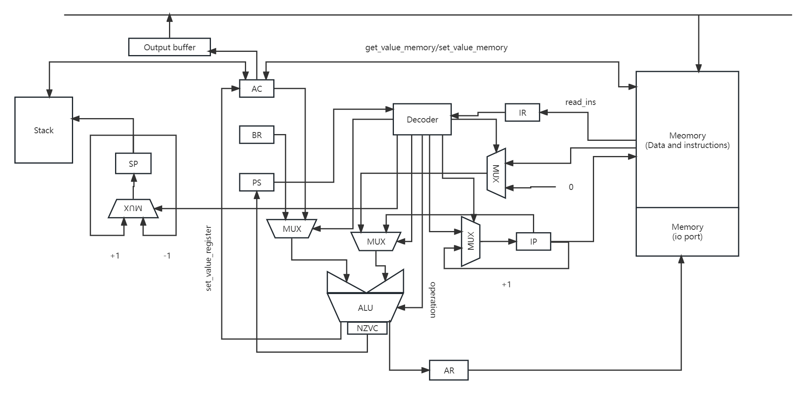

* Ляо Ихун P33131

* asm | acc | neum | hw | tick| struct | stream| mem | prob5

## Языки программирования

* Сам язык нечувствителен к регистру. За исключением объявлений символов. Например ld #1 равно LD #1

* Первая функция объзательно _start, которая является входом.
* Код выполняется последовательно. Операции:

  - `ld аргумент` -- загрузить значение в аккумулятор из памяти

  - `st аргумент` -- выгрузить значение из аккумулятора в память

  - `add аргумент` -- прибавить к значению аккумулятора указанное

  - `sub аргумент` -- вычесть из значения аккумулятора указанное

  - `mul аргумент` -- помножить значение аккумулятора на указанное

  - `div аргумент` -- поделить значение аккумулятора на указанное

  - `cmp аргумент` -- сравнить значение  аккумулятора  с указанным и поставить значение состояния

  - `jmp аргумент` -- безусловный переход в указанное место в программе

  - `jz аргумент` -- переход в случае, если только бит Z = 0

  - `js аргумент` -- - переход в случае, если значение аккумулятора меньше чем значение указанное

  - `jnz аргумент` -- переход в случае, если не только бит Z = 0
  - `hlt` -- точка останова
  - `push` -- толкнуть значние аккумулятора в стек
  - `pop` --  прочитать одно значние из стека в аккумулятор
  - `call аргумент` -- вызвать функцию
  - `ret` -- выйти из функции
  - `inv` -- получить обратное число аккумулятора.
* Все после ";" считается комментарией в строке
* Поддерживает кордирование символа. Символы сохраняются в памяти как число:

```

' ':0, 'a':1, 'b':2, 'c':3, 'd':4, 'e':5, 'f':6, 'g':7, 'h':8, 'i':9, 'j':10,
'k':11, 'l':12, 'm':13, 'n':14, 'o':15, 'p':16, 'q':17, 'r':18, 's':19, 't':20, 'u':21,'v':22, 'w':23, 'x':24, 'y':25, 'z':26, 'A':27, 'B':28, 'C':29, 'D':30, 'E':31, 'F':32,'G':33, 'H':34, 'I':35, 'J':36, 'K':37, 'L':38, 'M':39, 'N':40, 'O':41, 'P':42, 'Q':43,'R':44, 'S':45, 'T':46, 'U':47, 'V':48, 'W':49, 'X':50, 'Y':51, 'Z':52, '':53, '0':54,'1':55, '2':56, '3':57, '4':58, '5':59, '6':60, '7':61, '8':62, '9':63, '!':64, ',':65,'.':66, '-':67, '*':68, '?':69, '+':70, '/':71, '@':72, '\0':73, '\n':74

```

* Управляющие метки:

  - `section .data` - метка, сигнализирующая о начале области данных. После нее можно объявлять переменные, но нельзя писать код.
  - `section .text` - метка, сигнализирующая о начале код

* Функция и метка:

  * Функцию так определим: '<Называние функции>:'
  * Метку так опредлим: '.<Называние метки>:'

  Разница в том что метка начинается с ".". И когда мы хотим переходить в какую-то метку, то нужно так использовать мекту:

  jmp .label_name

* Адресация(формат аргумента):

  * Прямая: если аргумент просто какое-то число, то он считается адрес. То есть, ld 29 - это значит загрузить значение в 30-ой ячейка в аккумулятор
  * Просто значение: если в аргументе есть  '#' и после него получается одно число, то аргумент считается значение. То есть, ld #29 - это загрузить 29 в аккумулятор
  * Переменные: если аргумент является переменной, которая определена в секции данных, то он считает адрес переменной.
  * Символ: кодируется в число по таблице символов. Например, ld 'A' = ld #27

* Значения состояния:

  * N = 1
  * Z = 2
  * V = 4
  * C = 8

* Переменные:

  * Определённы таким образом: '<Называние: Значение>'. Значение может быть числом или строкой. Если строкой, то она будет обладать столько количеств ячейк, сколько количеств её символов. 

## Организация памяти

Память команд и данных одна.

Память является списком, который состоит из ячейк. Ячейк реализуется классом Cell.В ячейке сохраняет

* Или число - то есть данные. Машинное слово - 32 бит, знаковое. **Одна ячейка только сохраняет один символ. Символ тоже в виде числа по таблице char, которую определяют в ISA**
* Или инструкция, которая представляется в виде класса - Instruction.**В объекте класса instruction сохраняет тип инструкции и аргумент**

Стек одельно создан.

Последное **1/4** части является IO портами, которые только служит для IO.

### Система команд

* Машинное слово -- 32 бит, знаковое.
* Архитектура - Фон Неймановская архитектура
* Регистры:

  * IP - счётчик
  * AC - 
    * аккумулятор
    * взаймодействует с стеком
    * сохраняет результат любой фунции
    * сохраняет результат любой математической операции
  * BR - как буфер, где временно сохраняют данные. Например, он применяется для сохранения результата фукции в инструкции ret. 
  * AR - указывающий адрес ячейки, с которой взаймодействуют, регистр. Тоже указывает? 'адрес' стека.
  * PS - NZVC. 
  * SP - указатель стека.

### Набор инструкции

| Syntax | Кол-во тактов пря | Кол-во тактов перем | Кол-во тактов зна | Кол-во тактов io | Кол-во тактов   | comment                                                      |
| ------ | ----------------- | ------------------- | ----------------- | ---------------- | --------------- | ------------------------------------------------------------ |
| ld     | 4                 | 4                   | 3                 | 4                | -               | загрузить значение в аккумулятор из памяти                   |
| st     | 3                 | 3                   | -                 | 3                | -               | выгрузить значение из аккумулятора в память                  |
| add    | 5                 | 5                   | 4                 | -                | -               | прибавить к значению аккумулятора указанное                  |
| sub    | 5                 | 5                   | 4                 | -                | -               | вычесть из значения аккумулятора указанное                   |
| div    | 5                 | 5                   | 4                 | -                | -               | поделить значение аккумулятора на указанное                  |
| inv    | -                 | -                   | -                 | -                | 4               | нет адресации. Получить обратное значение                    |
| mul    | 5                 | 5                   | 4                 | -                | -               | помножить значение аккумулятора на указанное                 |
| cmp    | 4                 | 4                   | 3                 | -                | -               | сравнить значение  аккумулятора  с указанным и поставить значение состояния |
| jmp    | -                 | -                   | -                 | -                | 2               | нет адресации. Безусловный переход в указанное место в программе |
| js     | -                 | -                   | -                 | -                | 3 - yes 2 -  no | переход в случае, если значение аккумулятора меньше чем значение указанное. Количество тактов зависит от наличии перехода. |
| jnz    | -                 | -                   | -                 | -                | 3 - yes 2 -  no | переход в случае, если не только бит Z = 0. Количество тактов зависит от наличии перехода. |
| jz     | -                 | -                   | -                 | -                | 3 - yes 2 -  no | переход в случае, если только бит Z = 0. Количество тактов зависит от наличии перехода. |
| call   | -                 | -                   | -                 | -                | 8               | вызвать функцию                                              |
| ret    | -                 | -                   | -                 | -                | 7               | выйти из функции                                             |
| push   | -                 | -                   | -                 | -                | 4               | толкнуть значние аккумулятора в стек                         |
| pop    | -                 | -                   | -                 | -                | 4               | прочитать одно значние из стека в аккумулятор                |
| hlt    | -                 | -                   | -                 | -                | 2               | точка останова. Количество тактов - это для чтения инструкции. |

**2 такта для чтения инструкции из памяти**

## Кодирование инструкций

Машинный код сериализуется в CSV

Вся программа разделяется на 3 часть. Разделяем её по символу ':':

- Первая часть - это просто иструменции. Состоит из трех частей.
  - Первая столбца - индекс инструкции
  - Вторая столбца - инструкции
  - Третья столбца - аргумент(если есть)
- Вторая часть - это фунции. Разделяем её по символу ':'.
  - Первая столбца - имя
  - Вторая столбца - индекс инструкии
- Третья часть - метка. Разделяем её по символу ':':
  - Первая столбца - имя фунции
  - Вторая столбца - имя метки
  - Третья столбца - индекс инструкии
- Четвёртая часть - переменные. Разделяем её по символу ':':
  - Первая столбца - имя переменной
  - Вторая столбца - значение
  - Третья столбца - длина строки(если есть)

Пример:

```
0 LD 'H' 
1 ST OUTPUT 
2 LD 'e' 
3 ST OUTPUT 
4 LD 'l' 
5 ST OUTPUT 
6 LD 'l' 
7 ST OUTPUT 
8 LD 'o' 
9 ST OUTPUT 
10 LD ',' 
11 ST OUTPUT 
12 LD 'w' 
13 ST OUTPUT 
14 LD 'o' 
15 ST OUTPUT 
16 LD 'r' 
17 ST OUTPUT 
18 LD 'l' 
19 ST OUTPUT 
20 LD 'd' 
21 ST OUTPUT 
22 HLT 
FUNCTION
_START:0
LABEL
_START:.LOOP:0
VARIABLE

```


## Транслятор

Командной строки: `translator.py <input_file> <target_file>"`

Реализовано в модуле: [translator](https://gitlab.se.ifmo.ru/Liao/ak-lab3/-/blob/master/translator.py)

Позволяет поддерживать основные debug:

* Нельзя определять две переменной однин имени
* Нельзя использовать "Input" или "Output" как называния переменных
* Проверяет правильно ли пользователь опредлять аргумент. Например, определять аргумент инструкции, у которой нет аргумента.
* Проверяет формат переменной.
* Информация ощибок будет указывать места ошибок.

Этапы трансляции (функция `translate`):

1. Проверка метка section .DATA
2. Чтение переменных и сохраняет их в славарь variable
3. Проверка метка section .TEXT
4. Чтение код
   1. Если строка является метка, то сохраняет её место, включающиую её функцию и называние в славарь label_in_fun.
   2. Если строка является фунцию, то сохраняет её место и называние в славарь function_point
   3. Если строка является инструкцией, то сохраняет его место, тип и аргумент в строку result
5. Когда читает строку, автоматически игнорирует комментарию
6. Перед любой обработкой из 1-4, строки будут преобразованы в верхний регистр.
7. Генерация выходной файл на основе result, variable, label_in_fun и function_point.

## Модель процессора

Реальзована в machine.py (https://gitlab.se.ifmo.ru/Liao/ak-lab3/-/blob/master/machine.py)
Командной строки: `machine.py <target_file> <inputfile>".`Если без ввода, тогда inputfile = "".

Такт(Hardwired):

* Операции на одном объекте не выполняются в одном такте.
* Операции на разных объектах выполняются в одном такте. 




## Апробация

| ФИО      | алг   | Loc  | code байт | code инстр. | инстру. | такт | вариант |
| -------- | ----- | ---- | --------- | ----------- | ------- | ---- | ------- |
| Ляо Ихун | prob5 | 47   | 1 KB      | 47          | 33      | 1453 | asm     |
| Ляо Ихун | cat   | 11   | 1 KB      | 11          | 6       | 762  | asm     |
| Ляо Ихун | hello | 27   | 1 KB      | 27          | 23      | 68   | asm     |
| Ляо Ихун | prob2 | 29   | 1 KB      | 29          | 18      | 1715 | asm     |

Реализации алготримов:

* [prob5](https://gitlab.se.ifmo.ru/Liao/ak-lab3/-/blob/master/asm/prob5.asm)
* [cat](https://gitlab.se.ifmo.ru/Liao/ak-lab3/-/blob/master/asm/cat.asm)
* [prob2](https://gitlab.se.ifmo.ru/Liao/ak-lab3/-/blob/master/asm/prob2.asm)
* [hello](https://gitlab.se.ifmo.ru/Liao/ak-lab3/-/blob/master/asm/hello.asm)

Реальзации тестов:

* [Тест машины](https://gitlab.se.ifmo.ru/Liao/ak-lab3/-/blob/master/test_machine.py)
* [Тест транслятора](https://gitlab.se.ifmo.ru/Liao/ak-lab3/-/blob/master/test_translator.py)

Журнал теста машины находится в папке [diary](https://gitlab.se.ifmo.ru/Liao/ak-lab3/-/tree/master/diary).
